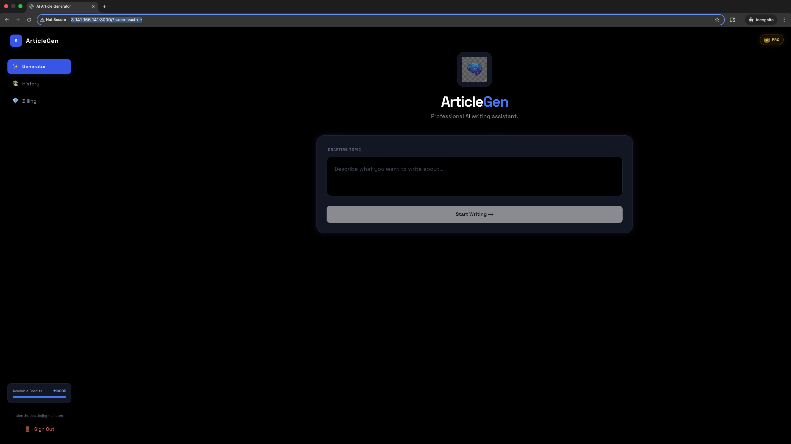

# 🧠 AI Article Generator SaaS

A production-ready Full Stack AI application that generates SEO-optimized blog posts using Google Gemini. Built with Next.js 15, TypeScript, Supabase, and Stripe.

 


## 🚀 Live Demo
**[View Live App](http://3.141.166.141:3000)**

# 🚀 ArticleGen - AI-Powered SaaS Platform

**ArticleGen** is a production-grade SaaS application designed to automate SEO content creation. It leverages the **Google Gemini Pro** model to generate high-quality, formatted blog posts in real-time.

Unlike simple wrapper applications, this project implements a full-stack architecture featuring **streaming AI responses**, credit-based usage limits via **Stripe**, and secure authentication with **Supabase**. The application is containerized with **Docker** and deployed to a scalable **AWS EC2** environment, demonstrating a complete CI/CD workflow from development to production.

### 🌟 Key Technical Highlights
- **Real-Time AI Streaming:** Implemented `TextDecoder` streams to deliver instant feedback to users, eliminating wait times for long-form content generation.
- **Credit System Logic:** Engineered a transactional credit deduction system using PostgreSQL triggers and Stripe webhooks to ensure payment data integrity.
- **Hybrid Architecture:** Utilized Next.js 15 Server Actions for secure backend logic while maintaining a responsive Client-Side UI.
- **Infrastructure as Code:** Fully Dockerized application hosted on AWS, utilizing GitHub Container Registry for version-controlled deployments.


## ✨ Features
- **🤖 AI Content Generation:** Powered by Google's Gemini AI.
- **🔐 Secure Authentication:** Complete user management with Supabase Auth.
- **💳 Payments:** Stripe integration for credit-based usage (Demo Account).
- **🌑 Dark Mode:** Professional, sleek UI built with Tailwind CSS.
- **⚡ Real-time Database:** Stores user history and credits instantly.

## 🛠️ Tech Stack
- **Frontend:** Next.js 15 (App Router), React, Tailwind CSS, Framer Motion
- **Backend:** Supabase (PostgreSQL, Auth), Next.js Server Actions
- **AI:** Google Gemini API
- **Deployment:** Docker, AWS EC2, GitHub Container Registry

## 🏗️ System Architecture

The application follows a modern **Monolithic Containerized Architecture**, designed for simplicity and ease of deployment while maintaining separation of concerns.
```mermaid
graph TD
    %% Nodes
    User([👤 User])
    Browser[💻 Browser Client\nNext.js + Tailwind]
    Server[⚙️ Next.js Server Actions\nBackend Logic]
    DB[(🗄️ Supabase\nPostgreSQL)]
    Auth[qb️ Supabase Auth]
    AI[🧠 Google Gemini API]
    Stripe[💳 Stripe Payment Gateway]
    Docker[🐳 Docker Container]
    AWS[☁️ AWS EC2 Server]

    %% Flows
    User -- "1. Writes Prompt" --> Browser
    Browser -- "2. POST /generate" --> Server
    Server -- "3. Check Credits" --> DB
    Server -- "4. Send Prompt" --> AI
    AI -- "5. Stream Response" --> Server
    Server -- "6. Stream Chunks" --> Browser
    Browser -- "7. Real-time UI Update" --> User
    
    %% Auth & Payments
    Browser -- "Login" --> Auth
    User -- "Purchase Credits" --> Stripe
    Stripe -- "Webhook: Payment Success" --> Server
    Server -- "Update User Credits" --> DB

    %% Deployment Context
    subgraph Deployment [AWS Cloud Environment]
        AWS --> Docker
        Docker --> Server
    end

### 🔧 Technical Workflow

1.  **Frontend (Client):** Built with **Next.js 15 App Router**. It uses `useStream` patterns to handle incoming data chunks from the AI, providing a "typing" effect that improves UX.
2.  **Backend (Server Actions):** Instead of a separate API server, I used Next.js Server Actions to keep the backend logic close to the UI. This ensures type safety and reduces network latency.
3.  **Database & Auth:** User sessions and data are managed by **Supabase**. Row Level Security (RLS) policies are enforced to ensure users can only access their own history.
4.  **AI Integration:** The app connects to **Google Gemini** via a streaming interface. This required handling `ReadableStreams` in Node.js to pass data through to the client without buffering the entire response.
5.  **DevOps:** The app is packaged into a **Docker** container. Updates are pushed to the **GitHub Container Registry (GHCR)**, and the **AWS EC2** instance pulls the latest image via a custom deployment script.

Built by Mano Balaji Cheepurupalli
